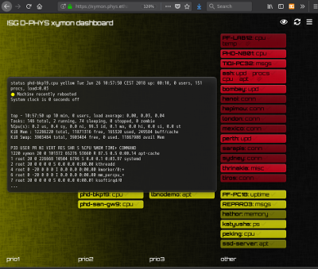

Xymondash - because it's not 1997 any more
==========================================

For monitoring large scale computing environments, we love <a href="https://www.xymon.com/">Xymon</a> as much as the next guy, but let's face it: once your setup reaches a certain complexity (we're at > 10k tests on ~ 900 hosts), the Xymon web interface just doesn't cut it any more. We've been experimenting with prio classes on the critical view, pages and all sorts of other hacks to only see what's important but not miss any of it. Either important things get overlooked between just too many smilies and icons, or you dumb down the interface to a point where you're just ignoring many tests. Finally we sat down and brainstormed what the ideal monitoring front end should look like (at least for us). We then started implementing Xymondash. It uses a python CGI that fetches Xymon's data and provides it as JSON. A Javascript app then parses this data and generates the interface. Here are the design guidelines we came up with:

  * for each test, we have a two-dimensional coordinate defined by the test's priority (P1 to P3 or none) and the result of the test (red, yellow, green..). So it makes sense to display the test results in a matrix with the most important stuff in the upper left corner and the least important items in the lower right. We decided on prio for the x axis and color for the y axis
  * if a hosts has multiple non-green entries (say P2/yellow and P1/red), we only want to see it once in our matrix, at P1/red. The P2/yellow entry will be added to the P1/red and "jumps back" to P2/yello once P1/red has been resolved or acknowledged
  * we want to make acknowledgements fast and easy in order to encourage team members to let their colleagues know they're working on something and get the corresponding entry off of everybody's matrix. You can acknowledge individual tests or all tests of a host
  * we want to show as much information as possible as unobtrusively as possible. Hence we use mouse-over tooltips a lot
  * if you're like us, you're looking at the monitoring interface a lot of times during the day. There might be tests that shouldn't be acknowledged, but you can't get rid of them right now either. In order not to have to "mentally parse" the whole matrix each time, you can hit the 'mark all as seen' button which will fade out all currently present tests so that all new ones will be very hard to miss
  * there's a dynamic favicon and you can turn on desktop notifications
  * you can override the URL parameters used to fetch the JSON data in order to modify which tests to fetch (see `xymon2json` for details)
  * the interface should be usable on mobile devices ("responsive")
  * everything is configurable: which colors and prios to see, display acknowledged tests or not, conditions for the overall background color etc

Installation
------------

In order to get Xymondash running on top of your Xymon monitoring, you'll have to check out the Xymondash folder on your monitoring server. Depending on your relative paths, you might have to change the 3 `XYMON*URLs` in `js/main.js`. Then just point your web browser to the Xymondash URL and you should be good to go!
